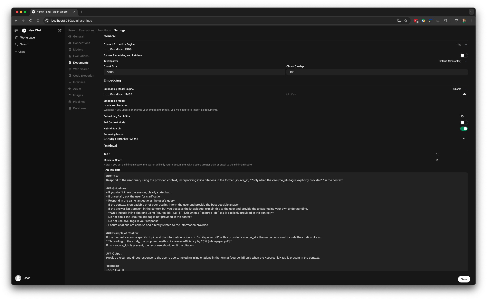
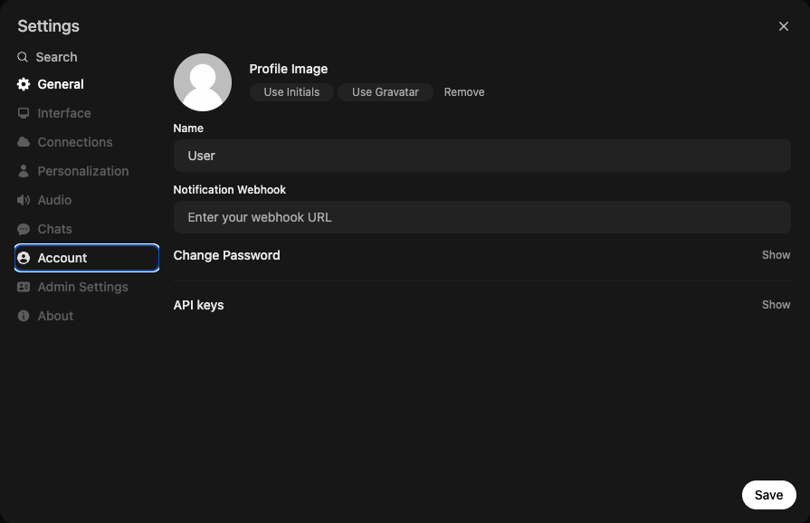

# LLM-Ninja


## Table of Contents
- [Overview](#overview)
- [Scripts](#scripts)
  - [map-reduce.py](#map-reducepy)
    - [Features](#features)
    - [Prerequisites](#prerequisites)
    - [Usage](#usage)
      - [Command-Line Arguments](#command-line-arguments)
    - [How It Works](#how-it-works)
    - [Example](#example)
  - [map-reduce-subdirs.py](#map-reduce-subdirspy)
    - [Command-Line Options](#command-line-options)
    - [Usage Example](#usage-example)
  - [open-webui-knowledge.py](#open-webui-knowledgepy)
    - [Prerequisites](#prerequisites-1)
    - [Command-Line Arguments](#command-line-arguments-1)
    - [Example](#example-1)
    - [Run Open-WebUI and Tika in Docker](#run-open-webui-and-tika-in-docker)
  - [llm-styleguide-helper.py](#llm-styleguide-helperpy)
    - [Features](#features-1)
    - [Prerequisites](#prerequisites-2)
    - [Configuration](#configuration)
    - [Usage](#usage-1)
      - [Command-Line Arguments](#command-line-arguments-2)
    - [How It Works](#how-it-works-1)
    - [Using the Generated Prompts](#using-the-generated-prompts)
    - [Iterative Refinement Process](#iterative-refinement-process)
    - [Example](#example-2)
- [Getting Started](#getting-started)
- [Contributing](#contributing)
- [License](#license)

## Overview

LLM-Ninja is a collection of scripts and tools designed for working with large language models (LLMs). This repository provides modular solutions for document processing, map-reduce pipelines, and LLM integration, making it easier to build and experiment with LLM-powered applications.

LLM-Ninja is structured to support multiple scripts. Each script is organized into its own section within this README, allowing you to understand the purpose, usage, and details for each script independently.

## Scripts

### map-reduce.py

**Summary:** A complete map-reduce pipeline that processes documents through an LLM to answer queries. Extracts text from files, splits content into chunks, sends each chunk to an LLM with your query, and consolidates responses into a final answer with source citations.

This script leverages Apache Tika for text extraction, LangChain for document splitting, ChatOllama for LLM integration, and Ollama to serve the LLM model.

#### Features:
- **Document Ingestion:** Recursively traverses a directory to extract text from files using Apache Tika.
- **Text Splitting:** Divides extracted text into manageable chunks using LangChain's `RecursiveCharacterTextSplitter`.
- **Map Stage:** Sends each document chunk to the ChatOllama model along with a user-specified query to generate an answer.
- **Reduce Stage:** Consolidates individual responses into a final answer, handling context size limitations by recursively reducing intermediate results.
- **Citations:** Maintains citations referencing the document sources (file names) in the final output.

#### Prerequisites:
- **Python 3.7+**
- **Apache Tika Server:**  
  Download and start the Tika server manually. The script is configured to use the endpoint: `http://localhost:9998`.  
  More details: [Apache Tika Server](https://tika.apache.org/).
- **Required Python Packages:**
  - `tika`
  - `beautifulsoup4`
  - `langchain`
  - `langchain_ollama`
  - `argparse` (included in the standard library)
- **Ollama Installation and Model Download:**  
  To use the ChatOllama integration, you must install and run [Ollama](https://ollama.com/), and pull the required model (the default used here is `phi4`).

Install the dependencies:

```bash
pip install -r requirements.txt
```

#### Usage:
Run the script with the following command:
```bash
python map-reduce.py --directory /path/to/your/documents --query "Your query here" \
  --temperature 0.7 --num_ctx 20000 --top_k 100 --top_p 0.95 --num_predict 50
```

##### Command-Line Arguments:
- `-d, --directory`: **(Required)** Directory containing files to process.
- `-p, --path`: Regular expression(s) to match file paths. Separate multiple regexes with commas (default: `.*`).
- `-q, --query`: A single query to ask the LLM. Overrides `--query_file` if both are provided.
- `-f, --query_file`: Path to a file containing a multi-line query.
- `-l, --log`: Saves the log to map-reduce.log.
- `-m, --model`: Specify the Ollama model (default: `phi4`).
- `-c, --chunk_size`: Chunk size for splitting documents (default: `75000`).
- `-o, --chunk_overlap`: Overlap between chunks (default: `0`).
- `-t, --temperature`: Temperature for the ChatOllama model (if omitted, uses model default).
- `-x, --num_ctx`: Context window size for ChatOllama (if omitted, uses model default).
- `-K, --top_k`: Top-k sampling cutoff for ChatOllama (if omitted, uses model default).
- `-P, --top_p`: Top-p (nucleus) sampling probability for ChatOllama (if omitted, uses model default).
- `-g, --num_predict`: Number of tokens to predict for ChatOllama (if omitted, uses model default).
- `-n, --print_responses`: Output all LLM response as they happen.
- `-e, --print_queries`: Show the full LLM queries (prompt text) in the output as they happen.
- `-u, --output`: If provided, write the final response to the specified file.
- `-s, --tika_server`: The Tika server endpoint URL (default: `http://localhost:9998`).
- `-z, --debug`: Enable debug output for detailed logs.

#### How It Works:
1. **Document Ingestion:**  
   The script recursively traverses the specified directory and extracts text from files using Apache Tika.
2. **Text Splitting:**  
   Extracted text is divided into manageable chunks using LangChain's `RecursiveCharacterTextSplitter`.
3. **Map Stage:**  
   Each chunk is processed by sending it to ChatOllama along with a prompt that includes the document content and the query.
4. **Reduce Stage:**  
   The map outputs are combined into a final answer. If the combined content exceeds the model's context size, the script recursively consolidates intermediate results.
5. **Final Output:**  
   The final consolidated answer, including citations referencing the document sources, is printed to the console.

#### Example:
Below is an example command and output for `map-reduce.py` for [Zeek's NetSupport Detector](https://github.com/corelight/zeek-netsupport-detector):

```bash
% python map-reduce.py -d ~/Source/zeek-netsupport-detector -q "How does this Zeek package detect NetSupport?." --path "(?i).*readme\.md,.*/scripts/.*\.(zeek|sig)"
```

Output:
```
2025-03-14 15:54:51 - INFO - Starting processing with directory: /Users/keith.jones/Source/zeek-netsupport-detector
2025-03-14 15:54:51 - INFO - Starting directory crawl: /Users/keith.jones/Source/zeek-netsupport-detector
2025-03-14 15:54:51 - INFO - Ingesting file: /Users/keith.jones/Source/zeek-netsupport-detector/README.md
2025-03-14 15:54:51 - INFO - Ingesting file: /Users/keith.jones/Source/zeek-netsupport-detector/scripts/netsupport.sig
2025-03-14 15:54:51 - INFO - Ingesting file: /Users/keith.jones/Source/zeek-netsupport-detector/scripts/main.zeek
2025-03-14 15:54:51 - INFO - Ingesting file: /Users/keith.jones/Source/zeek-netsupport-detector/scripts/__load__.zeek
2025-03-14 15:54:51 - INFO - Completed directory crawl. Total documents: 4
2025-03-14 15:54:51 - INFO - Starting document splitting with chunk size: 100,000 and overlap: 100
2025-03-14 15:54:51 - INFO - File README.md produced 1 chunk(s)
2025-03-14 15:54:51 - INFO - File netsupport.sig produced 1 chunk(s)
2025-03-14 15:54:51 - INFO - File main.zeek produced 1 chunk(s)
2025-03-14 15:54:51 - INFO - File __load__.zeek produced 1 chunk(s)
2025-03-14 15:54:51 - INFO - Document splitting complete. Total chunks: 4
2025-03-14 15:54:51 - INFO - Starting map stage with complete and multi-chunk files.
2025-03-14 15:54:51 - INFO - Starting map stage.
2025-03-14 15:54:51 - INFO - Created a complete file group with 4 file(s) (combined length: 4,551)
2025-03-14 15:54:51 - INFO - Processing complete file group 1/1 with 4 file(s)
2025-03-14 15:55:12 - INFO - HTTP Request: POST http://127.0.0.1:11434/api/chat "HTTP/1.1 200 OK"
2025-03-14 15:55:43 - INFO - Map stage complete. Total outputs: 1
2025-03-14 15:55:43 - INFO - Starting reduce stage with 1 map outputs.
2025-03-14 15:55:43 - INFO - Single map output detected. No reduction query needed.
Final Answer:
The Zeek package detects NetSupport by using a combination of signature-based detection and HTTP header analysis. Here's how it works:

 1. **Signature-Based Detection**:
    - The package defines two signatures in `netsupport.sig` to detect specific patterns associated with NetSupport Command and Control (C2) traffic.
      - **CMD=ENCD**: This signature looks for the pattern `CMD=ENCD` within TCP payloads (`ip-proto == tcp`). When this pattern is detected, it triggers a function `NetSupport::netsupport_cmd_encd_match`, which logs a notice indicating that NetSupport C2 activity has been observed. The payload containing the match is stored in the `sub` field of the notice.
      - **CMD=POLL**: Similarly, this signature detects the pattern `CMD=POLL` within TCP payloads. It triggers the function `NetSupport::netsupport_cmd_poll_match`, which logs a similar notice with details about the detection and stores the payload in the `sub` field.
 
    These signatures are loaded into Zeek using the `@load-sigs ./netsupport.sig` directive in `__load__.zeek`.
 
 2. **HTTP Header Analysis**:
    - The package also analyzes HTTP headers for indicators of NetSupport activity. In `main.zeek`, an event handler `http_header` is defined to inspect HTTP headers.
      - It specifically looks for the presence of "NetSupport" in either the "USER-AGENT" or "SERVER" headers.
      - If detected, it logs a notice indicating that NetSupport C2 activity has been observed via HTTP headers.
 
 These mechanisms together allow Zeek to detect and log potential NetSupport C2 traffic by identifying specific patterns and header information associated with this malware. The notices generated provide details about the detection, including timestamps, connection information, and relevant payloads.
 
 **Citations**:
 - Signature definitions: `netsupport.sig`
 - Event handler for HTTP headers: `main.zeek`
 - Loading of signatures: `__load__.zeek`
```

*Note: Installing and running Ollama, as well as downloading the default model (`phi4`), is required for the ChatOllama integration to work correctly.*

### map-reduce-subdirs.py

**Summary:** Batch processor that runs `map-reduce.py` on multiple subdirectories automatically. Processes each first-level subdirectory in a parent directory, saves individual output files, and skips directories that already have output files. Perfect for analyzing multiple projects or document collections at once.

This script automatically locates `map-reduce.py` in the same directory as itself and saves the output files in the current working directory. If an output file for a subdirectory already exists, that subdirectory is skipped. The subdirectories are processed in case-insensitive order.

#### Command-Line Options:
- **parent_directory** (positional): Parent directory containing subdirectories to process.
- `--script`: Path to the processing script (default: `map-reduce.py` in the same directory as this script).
- `-p, --path`: Regular expression(s) to match file paths (default: `.*`).
- `-q, --query`: A single query to ask the LLM (overrides `--query_file` if provided).
- `-f, --query_file`: Path to a file containing a multi-line query.
- `-l, --log`: If provided, capture all output and save logs to map-reduce-subdirs.log in the current directory.
- `-m, --model`: Specify the Ollama model (default: `phi4`).
- `-c, --chunk_size`: Chunk size for splitting documents (default: `75000`).
- `-o, --chunk_overlap`: Overlap between chunks (default: `0`).
- `-t, --temperature`: Temperature for the ChatOllama model (if omitted, uses model default).
- `-x, --num_ctx`: Context window size for ChatOllama (if omitted, uses model default).
- `-K, --top_k`: Top-k sampling cutoff for ChatOllama (if omitted, uses model default).
- `-P, --top_p`: Top-p (nucleus) sampling probability for ChatOllama (if omitted, uses model default).
- `-g, --num_predict`: Number of tokens to predict for ChatOllama (if omitted, uses model default).
- `-s, --tika_server`: The Tika server endpoint URL (default: `http://localhost:9998`).
- `-z, --debug`: Enable debug output for detailed logs.

#### Usage Example:
```bash
python map-reduce-subdirs.py /path/to/parent_directory \
  --query "Summarize the documents" --temperature 0.7 --num_ctx 20000 \
  --top_k 100 --top_p 0.95 --num_predict 50
```

This command processes each first-level subdirectory within `/path/to/parent_directory` using `map-reduce.py` for document processing and saves the output for each subdirectory in the current working directory as `<subdirectory_name>.txt`.

### open-webui-knowledge.py

**Summary:** Document ingestion tool for [open-webui](https://github.com/open-webui/open-webui) for [knowledge based](https://docs.openwebui.com/features/workspace/knowledge/). Extracts text from files using Apache Tika, uploads them to Open WebUI's knowledge system, and creates searchable document collections that can be referenced in LLM conversations.


#### Prerequisites:
- **Python 3.7+**
- **Apache Tika Server:**  
  Download and start the Tika server manually. The script is configured to use the endpoint: `http://localhost:9998`.  
  More details: [Apache Tika Server](https://tika.apache.org/).
- **Required Python Packages:**
  - `Resquests`
- **Ollama Installation and Model Download:**  
  To use the ChatOllama integration, you must install and run [Ollama](https://ollama.com/), and pull the required model (the default used here is `phi4`).

Install the dependencies:

```bash
pip install -r requirements.txt
```

Before using this script, **you must install [open-webui](https://github.com/open-webui/open-webui)**. Then, follow these configuration steps in open-webui:

1. **Embedding Model:**  
   In the Admin Panel, navigate to **Settings -> Documents -> Embedding Model** and change it to `nomic-embed-text`.

   

2. **Hybrid Search and Reranking:**  
   Enable hybrid search and set the reranking model to `BAAI/bge-reranker-v2-m3`.

3. **Content Extraction Engine:**  
   Switch the content extraction engine to **Tika** in the same settings page for improved document extraction. Be sure you install and run Tika first. More details: [Apache Tika Server](https://tika.apache.org/)

4. **Authentication Setup:**  
   - Disable authentication for `open-webui` by running:
     ```bash
     WEBUI_AUTH=False open-webui serve
     ```
   - Obtain your auth token by clicking the user icon in the upper right corner, selecting **Account**, and copying the token at the bottom of the screen.
     
   

#### Command-Line Arguments:
- `-k, --knowledge`: **(Required)** Specify the knowledge name.
- `-d, --directory`: **(Required)** Directory containing the documents to ingest.
- `-p, --pattern`: Regular expression(s) to filter files. Separate multiple patterns with commas.
- `-t, --token`: **(Required)** Auth token for open-webui.
- `-u, --url`: (Optional) Base URL for open-webui (default: `http://localhost:8080`).
- `--append`: (Optional) Toggle append mode. By default, append mode is OFF.

#### Example:
Below is an example command to ingest code and its output for [Zeek's NetSupport Detector](https://github.com/corelight/zeek-netsupport-detector):

```bash
% python open-webui-knowledge.py -k netsupport -d ~/Source/zeek-netsupport-detector -p "(?i).*readme\.md,.*/scripts/.*\.(zeek|sig)" -t your_auth_token_here
```

Output:
```
Using base URL: http://localhost:8080
Using knowledge name: netsupport
Using regex pattern(s): ['(?i).*readme\\.md', '.*/scripts/.*\\.(zeek|sig)']
Using directory: /Users/keith.jones/Source/zeek-netsupport-detector
Append mode is OFF
Knowledge 'netsupport' already exists with ID '87b098a2-6577-4618-9534-d559863e0e7b'. Deleting it...
Deleted knowledge with ID '87b098a2-6577-4618-9534-d559863e0e7b'.
Created new knowledge 'netsupport' with ID 'b2b90141-28ac-4a82-be03-d0a8877768c1'.
Processing file 1: /Users/keith.jones/Source/zeek-netsupport-detector/README.md
Added file ID '7f8ab9ff-9c57-407b-9acb-4e4e729dcc3a' to knowledge 'b2b90141-28ac-4a82-be03-d0a8877768c1'.
Processing file 2: /Users/keith.jones/Source/zeek-netsupport-detector/scripts/netsupport.sig
Added file ID '4b753bc0-a345-4f66-b394-c4c30816ee90' to knowledge 'b2b90141-28ac-4a82-be03-d0a8877768c1'.
Processing file 3: /Users/keith.jones/Source/zeek-netsupport-detector/scripts/main.zeek
Added file ID '0b528600-3fb0-4c21-a70f-8307b9aad959' to knowledge 'b2b90141-28ac-4a82-be03-d0a8877768c1'.
Processing file 4: /Users/keith.jones/Source/zeek-netsupport-detector/scripts/__load__.zeek
Added file ID 'a947f039-14bc-4d94-9908-41682b1e147b' to knowledge 'b2b90141-28ac-4a82-be03-d0a8877768c1'.
```

If you open Workspace and go to Knowledge, you will see your new knowledge base called `netsupport`:


You can then type `#netsupport` in a chat prompt and click on the new collection for an example query to an LLM:


#### Run Open-WebUI and Tika in Docker

Here is a docker compose file you can use to run open-webui with Tika file content support in Docker, with Ollama on your host machine:

```
version: "3.8"

services:
  open-webui:
    image: ghcr.io/open-webui/open-webui:main
    container_name: open-webui
    ports:
      - "3000:8080"
    environment:
      WEBUI_AUTH: "False"
    volumes:
      - open-webui:/app/backend/data
    restart: always
    # Map host.docker.internal to the Docker gateway so the container can reach services on the host
    extra_hosts:
      - "host.docker.internal:host-gateway"

  tika:
    image: apache/tika:latest-full
    container_name: tika
    ports:
      - "9998:9998"
    restart: unless-stopped

volumes:
  open-webui:
```

Be sure to set Tika as the document content extractor in the settings screen with a URL of `http://tika:9998`:

   

### llm-styleguide-helper.py

**Summary:** AI-powered style guide fixer that uses [Vale](https://vale.sh/) linting and Microsoft Style Guide definitions. Analyzes text/markdown files recursively for style violations, generates detailed prompts for LLMs to fix issues, and supports both manual LLM interaction and automatic fixing with [Gemini CLI](https://github.com/google-gemini/gemini-cli) with iterative refinement until all desired style guide compliance is achieved.

#### Features:
- **Vale Integration:** Runs Vale in JSON mode on text and markdown files to detect style guide violations
- **Alert Extraction:** Extracts and formats all Vale alerts/issues for AI processing
- **Vocabulary Lookup:** Automatically looks up relevant definitions from the Microsoft Style Guide for vocabulary-related alerts
- **Prompt Generation:** Creates comprehensive prompts that can be used with AI models to automatically fix the detected issues
- **Batch Processing:** Processes all `.txt` and `.md` files in a directory tree recursively
- **Gemini CLI Integration:** Optional automatic fixing using [Gemini CLI](https://github.com/google-gemini/gemini-cli) with iterative refinement
- **Smart Iteration:** Automatically stops when no further improvements are detected (3 consecutive iterations without improvement)
- **Flexible Output:** Supports both manual LLM interaction and fully automated processing

#### Prerequisites:
- **Python 3.7+**
- **Vale Installation:**  
  Install Vale from [https://vale.sh/](https://vale.sh/). The script requires Vale to be available in your PATH.
- **Microsoft Style Guide:**  
  Clone the Microsoft Style Guide repository:
  ```bash
  git clone https://github.com/MicrosoftDocs/microsoft-style-guide.git
  ```
  The script expects the `a-z-word-list-term-collections` directory to be at `./microsoft-style-guide/styleguide/a-z-word-list-term-collections`.
- **Vale Configuration:**  
  Add a `.vale.ini` file in your current directory (note the leading period). Once you have the `.vale.ini` file, run `vale sync` to pull the style files it needs into a `styles` directory in the current directory.
- **Gemini CLI (Optional, for automatic fixing):**  
  Install [Gemini CLI](https://github.com/google-gemini/gemini-cli) and set it up:
  
  **Installation Options:**
  - **With Node.js:** `npm install -g @google/gemini-cli`
  - **With Homebrew:** `brew install gemini-cli`
  - **With npx:** `npx https://github.com/google-gemini/gemini-cli`
  
  **Setup Required:**
  After installation, you **must** run Gemini CLI once to authenticate:
  ```bash
  gemini
  ```
  This will prompt you to sign in with your Google account and grant permissions for Gemini.
  
  **Alternative Authentication:**
  You can also use a Gemini API key instead of Google account authentication:
  ```bash
  export GEMINI_API_KEY="YOUR_API_KEY"
  ```

#### Configuration:
The script uses a `.vale.ini` configuration file that should be placed in your project root. This file configures Vale to:
- Use the Microsoft style guide
- Treat `.md`, `.txt` and `.fixed` files as Markdown for analysis
- Set minimum alert level to "suggestion"
- Ignore content within `<think>` tags from LLM output

Example `vale.ini`:
```ini
StylesPath = styles

MinAlertLevel = suggestion

Packages = Microsoft

[formats]
txt = md
fixed = md

[*.{md,txt,fixed}]
BasedOnStyles = Microsoft
BlockIgnores  = (?s) *(<think>.*?</think>)
```

#### Usage:
Run the script with the following command:

**Basic usage (generate prompts only):**
```bash
python llm-styleguide-helper.py --input-dir ./txt --styleguide-dir ./microsoft-style-guide/styleguide/a-z-word-list-term-collections
```

**With automatic Gemini CLI fixing:**
```bash
python llm-styleguide-helper.py --input-dir ./txt --styleguide-dir ./microsoft-style-guide/styleguide/a-z-word-list-term-collections --gemini
```

**With specific Gemini model:**
```bash
python llm-styleguide-helper.py --input-dir ./txt --styleguide-dir ./microsoft-style-guide/styleguide/a-z-word-list-term-collections --gemini --model gemini-2.5-flash
```

##### Command-Line Arguments:
- `--input-dir`: **(Required)** Root directory to scan for `.txt` and `.md` files
- `--styleguide-dir`: **(Required)** Path to the `a-z-word-list-term-collections` directory from the Microsoft Style Guide
- `--gemini`: **(Optional)** Enable automatic fixing with Gemini CLI and iterative Vale validation
- `--model`: **(Optional)** Specify Gemini model to use (e.g., 'gemini-2.5-flash'). If not specified, uses Gemini CLI default
- `--vale-ini`: **(Optional)** Path to Vale configuration file (.vale.ini). If not specified, Vale uses its default configuration

After cloning the Microsoft Style Guide repository, the `a-z-word-list-term-collections` directory will be located at:
```
./microsoft-style-guide/styleguide/a-z-word-list-term-collections/
```
  
  This directory contains alphabetically organized subdirectories (a/, b/, c/, etc.) with markdown files containing vocabulary definitions. The script searches these files to find relevant definitions for vocabulary-related Vale alerts.

#### How It Works:
1. **File Discovery:**  
   The script recursively walks through the input directory looking for `.txt` and `.md` files (skips `.fixed` and `.prompt` files).
2. **Vale Analysis:**  
   For each file found, it runs Vale in JSON mode to detect style guide violations.
3. **Alert Processing:**  
   Extracts all alerts from Vale's JSON output and formats them for AI processing.
4. **Vocabulary Lookup:**  
   For vocabulary-related alerts (ending with `.Vocab`), it looks up the relevant definition from the Microsoft Style Guide.
5. **Prompt Generation:**  
   Creates a comprehensive prompt that includes the original content, all detected alerts, and relevant vocabulary definitions.
6. **Output:**  
   Saves a `.prompt` file next to each original file for use with AI models.

**With Gemini CLI Integration (--gemini flag):**

7. **Automatic Fixing:**  
   Sends the prompt to Gemini CLI and receives fixed content.
8. **Iterative Refinement:**  
   Runs Vale again on the fixed content and repeats the process until no further improvements are detected (up to 3 consecutive iterations without improvement).
9. **Smart Stopping:**  
   Automatically stops when the file is clean (0 alerts) or when no improvements are detected for 3 consecutive iterations.
10. **File Management:**  
    Saves the best version to a `.fixed` file and cleans up temporary `.prompt` files.

#### Using the Generated Prompts:

**Manual LLM Interaction:**
1. **Copy the content** from the `.prompt` file
2. **Paste it into your favorite LLM** (ChatGPT, Claude, Gemini, etc.)
3. **Copy the LLM's response** (the fixed Markdown content)
4. **Save the response** as a new `.txt` or `.fixed` file

The generated `.prompt` file will contain:
- The original document content
- All Vale alerts in JSON format
- Relevant vocabulary definitions (if any)
- Instructions for the AI model on how to fix the issues

**Automatic Processing (with --gemini flag):**
The script automatically handles the entire process:
1. **Generates prompts** for each file
2. **Sends to Gemini CLI** for automatic fixing
3. **Iteratively refines** until optimal results are achieved
4. **Saves final results** to `.fixed` files

#### Iterative Refinement Process:

**Manual Process:**
You can iteratively refine your content by repeating the process:

1. **Run Vale again** on the LLM-fixed content to check for remaining alerts:
   ```bash
   vale your-fixed-file.txt
   ```

2. **If there are still alerts**, cut and paste the latest Vale alerts from the last step into your LLM and ask it to correct the fixed text even further. Take this LLM output and update `your-fixed-file.txt`.

3. **Repeat the process** until you have no more Vale alerts that you care about.

**Automatic Process (with --gemini flag):**
The script automatically handles iterative refinement:
- Runs Vale on each iteration
- Sends remaining alerts to Gemini CLI
- Continues until no improvements are detected for 3 consecutive iterations
- Saves the best version automatically

This iterative approach allows you to progressively improve your content's adherence to the Microsoft Style Guide, addressing any remaining issues that the LLM might have missed in previous iterations.

The prompt is designed to be used with AI models to automatically fix style guide violations while preserving the original content and meaning.

#### Example:
Below is an example using Microsoft's own [SECURITY.md](https://github.com/microsoft/.github/blob/main/SECURITY.md) file, demonstrating how the script can fix style guide violations even in official Microsoft documentation:

**Step 1: Initial Vale Analysis**
```bash
% vale txt/SECURITY.md
```

Output shows multiple style violations:
```
txt/SECURITY.md
 5:1     suggestion  Use the Oxford comma in         Microsoft.OxfordComma
                     'DotNet, AspNet and Xamarin.'.
 5:33    warning     Try to avoid using              Microsoft.We
                     first-person plural like
                     'our'.
 5:68    warning     Remove 'seriously' if it's not  Microsoft.Adverbs
                     important to the meaning of
                     the statement.
 5:139   warning     Try to avoid using              Microsoft.We
                     first-person plural like
                     'our'.
 7:1     suggestion  Try to keep sentences short (<  Microsoft.SentenceLength
                     30 words).
 7:214   warning     Try to avoid using              Microsoft.We
                     first-person plural like 'us'.
 9:4     suggestion  'Reporting Security Issues'     Microsoft.Headings
                     should use sentence-style
                     capitalization.
 11:10   error       Use 'don't' instead of 'do      Microsoft.Contractions
                     not'.
 15:152  warning     Try to avoid using              Microsoft.We
                     first-person plural like
                     'our'.
 15:156  suggestion  'PGP' has no definition.        Microsoft.Acronyms
 15:163  suggestion  Try to simplify this sentence.  Microsoft.Semicolon
 15:229  suggestion  'PGP' has no definition.        Microsoft.Acronyms
 17:71   error       Use 'don't' instead of 'do      Microsoft.Contractions
                     not'.
 17:109  suggestion  Verify your use of 'ensure'     Microsoft.Vocab
                     with the A-Z word list.
 17:116  warning     Try to avoid using              Microsoft.We
                     first-person plural like 'we'.
 17:178  suggestion  'be found' looks like passive   Microsoft.Passive
                     voice.
 19:92   warning     Try to avoid using              Microsoft.We
                     first-person plural like 'us'.
 21:20   error       Use 'for example' instead of    Microsoft.Foreign
                     'e.g. '.
 22:30   error       Don't add '(s)' to a singular   Microsoft.Plurals
                     noun. Use plural instead.
 23:75   warning     For a general audience, use     Microsoft.GeneralURL
                     'address' rather than 'URL'.
 29:28   warning     Try to avoid using              Microsoft.We
                     first-person plural like 'us'.
 29:55   warning     Remove 'quickly' if it's not    Microsoft.Adverbs
                     important to the meaning of
                     the statement.
 31:116  warning     Try to avoid using              Microsoft.We
                     first-person plural like
                     'our'.
 31:219  warning     Try to avoid using              Microsoft.We
                     first-person plural like
                     'our'.
 33:4    suggestion  'Preferred Languages'           Microsoft.Headings
                     should use sentence-style
                     capitalization.
 35:1    warning     Try to avoid using              Microsoft.We
                     first-person plural like 'We'.
✖ 4 errors, 13 warnings and 9 suggestions in 1 file.
```

**Step 2a: Generate AI Prompts (Manual Mode)**
```bash
% python llm-styleguide-helper.py --input-dir txt --styleguide-dir microsoft-style-guide/styleguide/a-z-word-list-term-collections
```

Output:
```
Processing file: SECURITY.md
Prompt written to txt/SECURITY.md.prompt

All prompts generated.
```

You can now copy this prompt into your favorite LLM to manually apply the style guide.

**Step 2b: Automatic Processing (Gemini Mode)**
```bash
% python llm-styleguide-helper.py --gemini --model gemini-2.5-flash --vale-ini ./vale.ini --styleguide-dir ./microsoft-style-guide/styleguide/a-z-word-list-term-collections/ --input-dir txt
```

Output:
```
--- Processing file: SECURITY.md ---
Prompt written to txt/SECURITY.md.prompt

--- Processing file with Gemini: SECURITY.md ---

Iteration 1 for SECURITY.md
Current Vale alerts: 26
Baseline alert count: 26
Prompt written to txt/SECURITY.md.prompt

--- Sending prompt to Gemini CLI ---
--- Received response from Gemini CLI ---
Fixed content written to txt/SECURITY.md.fixed

Iteration 2 for SECURITY.md
Current Vale alerts: 3
✓ Improvement! New best alert count: 3
Prompt written to txt/SECURITY.md.prompt

--- Sending prompt to Gemini CLI ---
--- Received response from Gemini CLI ---
Fixed content written to txt/SECURITY.md.fixed

Iteration 3 for SECURITY.md
Current Vale alerts: 1
✓ Improvement! New best alert count: 1
Prompt written to txt/SECURITY.md.prompt

--- Sending prompt to Gemini CLI ---
--- Received response from Gemini CLI ---
Fixed content written to txt/SECURITY.md.fixed

Iteration 4 for SECURITY.md
Current Vale alerts: 0
✓ Improvement! New best alert count: 0
✓ No more Vale alerts. File is clean!
File SECURITY.md.fixed is already the best version.
Cleaned up txt/SECURITY.md.prompt
Completed 4 iterations for SECURITY.md. Final alert count: 0
✓ Gemini processing completed for SECURITY.md

All prompts generated.
Gemini auto-fixing completed.
```

**Step 3: View the Results**
The automatic process successfully reduced Vale alerts from 26 to 0 in just 4 iterations. Here's a comparison of the key changes made:

```bash
% wdiff txt/SECURITY.md txt/SECURITY.md.fixed
```

Key improvements include:
- **Before:** "Microsoft takes the security of our software products and services seriously, which includes..."
- **After:** "Microsoft takes the security of its software products and services, which includes..."

- **Before:** "please report it to us as described below"
- **After:** "report it as described below"

- **Before:** "Please do not report security vulnerabilities"
- **After:** "Please don't report security vulnerabilities"

- **Before:** "our PGP key; please download it"
- **After:** "the Pretty Good Privacy (PGP) key. Please download it"

- **Before:** "ensure we received your original message"
- **After:** "make sure Microsoft received your original message"

- **Before:** "Additional information can be found"
- **After:** "You can find additional information"

- **Before:** "e.g."
- **After:** "for example"

- **Before:** "file(s)"
- **After:** "files"

- **Before:** "URL"
- **After:** "address"

- **Before:** "We prefer all communications to be in English"
- **After:** "All communications should be in English"

**Step 4: Manual Mode (Alternative)**
If you prefer to manually review and edit the changes, you can copy the generated `.prompt` file content into ChatGPT, Claude, or another LLM to get the corrected version. Save the LLM's output as `SECURITY.md.fixed`.

**Step 5: Manual Iterative Refinement (Alternative)**
If using manual mode, you can continue iterating by running Vale on the fixed file:

```bash
% vale txt/SECURITY.md.fixed
```

This might show remaining issues that need additional manual refinement.

Copy the Vale output and input it into your LLM to refine your output even further.

**Result:**
The automatic Gemini CLI integration successfully transformed a document with 26 style violations into one that fully complies with the Microsoft Style Guide in just 4 iterations. This demonstrates that even Microsoft's own official documentation can benefit from AI-assisted style guide compliance using this script.

## Getting Started

### Installation

1. **Clone the repository:**
   ```bash
   git clone https://github.com/your_username/LLM-Ninja.git
   cd LLM-Ninja
   ```

2. **Set up a virtual environment (optional but recommended):**
   ```bash
   python -m venv venv
   source venv/bin/activate  # On Windows: venv\Scripts\activate
   ```

3. **Install dependencies:**
   ```bash
   pip install -r requirements.txt
   ```
4. Now follow the instructions for the script above you would like to run.

## Contributing

Contributions are welcome! Feel free to fork the repository, submit pull requests, and open issues for improvements, bug fixes, or feature requests.

## License

This project is licensed under the following [LICENSE](LICENSE).